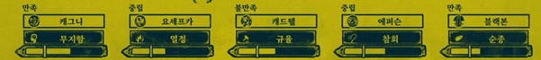
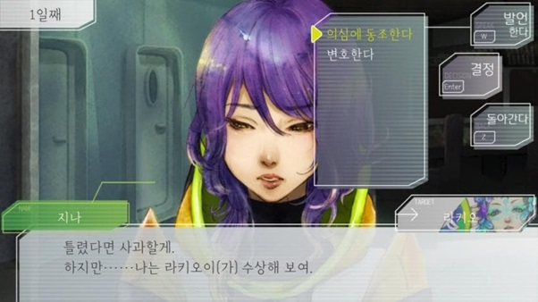
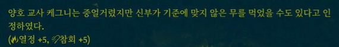
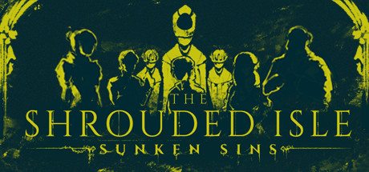
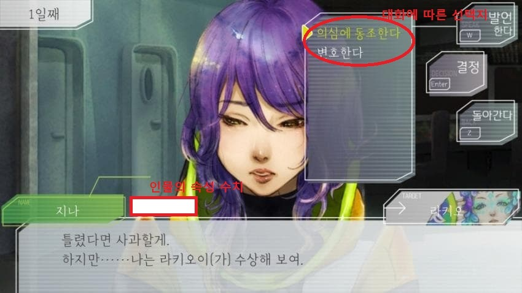
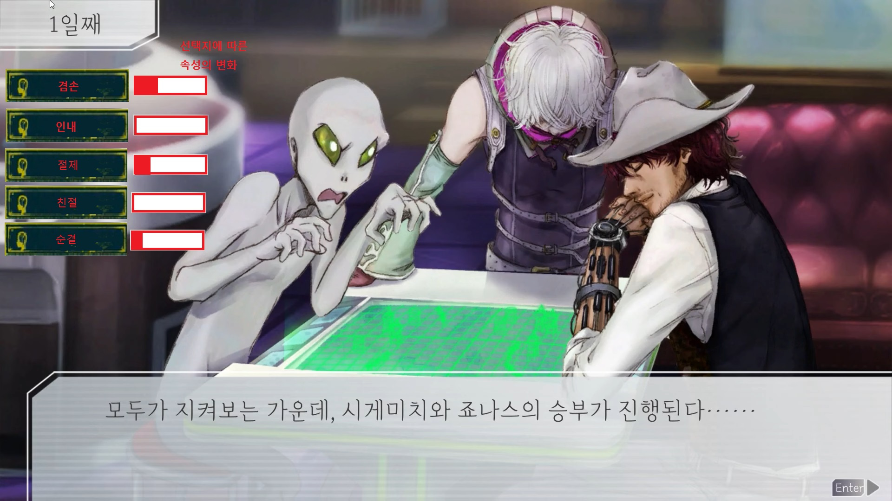
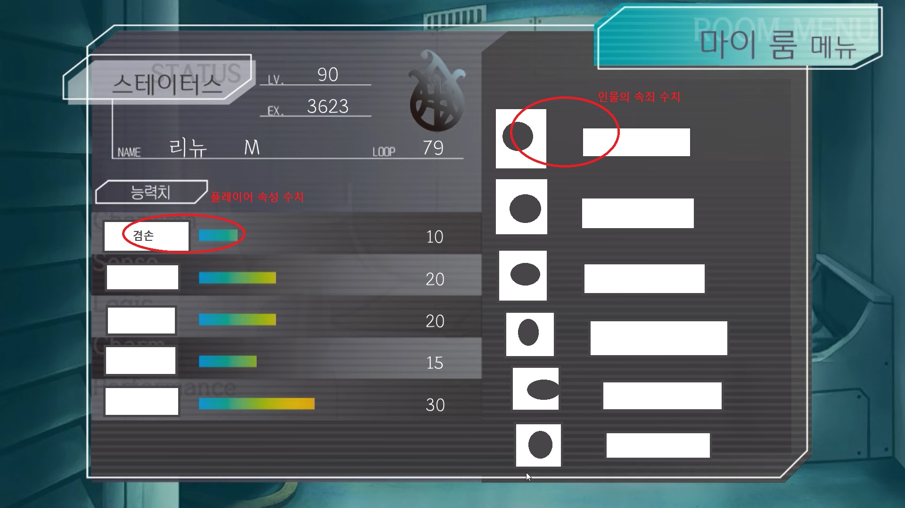

# 프로젝트명 :  신(Sin)

#
#

# [컨셉]

## 메인 컨셉 : 죄악
- 전체적인 스토리와 등장인물은 7대 죄악을 모티브로 하여 진행되지만 이는 플레이어들에게 명시적으로 제공되지 않는다.

### 서브 컨셉 1 : 선택
- 주인공은 스토리를 진행하면서 등장인물간의 갈등과 문제 상황을 해결하고 조율해나가며 여러 선택지 중 하나의 상황을 고른다.

### 서브 컨셉 2 : 성장
- 선택을 하게 된 플레이어는 어떤 선택을 했느냐에 따라 이에 맞는 속성을 증가시키며 다른 인물들의 속성에도 영향을 끼친다.

### 서브 컨셉 3 : 주선
- 플레이어의 속성으로 각각의 주선은 7대 죄악과 반대되는 의미를 지니며 엔딩과 밀접한 관련을 지닌다.

### 서브 컨셉 4 : 인물
- 등장인물들은 7대 죄악의 각 속성을 모티브로 하며 그에 맞춰 행동한다.

### 서브 컨셉 5 : 신
- 죄와 불륜을 의미하는 이름을 가진 플레이어 '신'은 신(god)처럼 본인의 뜻대로 문제를 해결해나가지만 플레이어 역시 죄악을 뜻하는 인물 중 하나이다.

#
#
#

# [관련 이미지 & 동영상]

#

- 이미지

     ▲ 게임 더 슈라우디드 아일(The Shrouded Isle)의 가문이 가진 죄악과 미덕

#

     ▲ 인물의 대사가 나타나고, 주인공이 여러 선택지 중 하나를 고른다.

#

     ▲ 선택지에 따라 주인공과 관련 인물이 가진 속성이 변화한다.

#

- 동영상

#

게임 더 슈라우디드 아일(The Shrouded Isle)은 시뮬레이션 게임으로 주인공이 죄악을 속죄하는 내용을 담고 있다. 각 가문은 죄악과 미덕을 하나씩 가지며 주인공이 어느 가문을 선택했느냐에 따라 해당하는 죄악이나 미덕에 영향을 받는다. 또한 플레이어의 행동에 따라 각기 다른 여러 엔딩이 등장한다.

#
#
#

# [대표 이미지]

#

     ▲ 선택 전 이미지

#

     ▲ 선택 후 이미지

#

     ▲ 플레이어 스탯창 이미지

#
#
#

# [컨셉 & 대표이미지 기반 작품묘사]

#

대표 이미지 기반 : 

- (UI구성) 플레이어의 피로도를 최소화하기 위해 최대한 직관적으로 정보를 얻을 수 있도록 함.

- (대화창) 나레이션과 인물들 간의 대화가 출력됨. 이름 옆에는 인물의 속성 수치가 표시됨.

- (우측) 스토리 흐름에 따른 플레이어의 선택지가 등장.

- (좌측) 플레이어의 선택 후, 이에 해당하는 속성의 진행바가 등장하며 올라감.

- (좌측상단) 스토리의 시간 흐름에 따라 변함.

- (스텟창) 시간의 흐름, 플레이어의 정보와 수치를 알 수 있으며, 등장인물의 정보와 수치 역시 한눈에 볼 수 있도록 함.

#
#
#

# [신(Sin) 구성 요소]

#

## 1. 메커니즘

#

[도전 과제]

- 인물들 간의 갈등에서 적합한 선택지를 고른다.

- 원하는 인물에게 다가가 플레이어의 속성을 높인다.

- 인물의 속죄 수치를 높인다.

- 플레이어의 특정 속성인 순결을 높인다.

#

[재미요소]

- 랜덤으로 정해지는 주인공의 속성과 사망 인물을 통해 인물 별 엔딩의 난이도가 변화한다.

- 랜덤으로 발생하는 사건 속에서 원하는 속성이 오를 수 있도록 한다.

- 시간이 지남에 따라 속죄 수치가 가장 낮은 인물이 사망한다.

#
#

## 2. 이야기

#

플레이어는 알 수 없는 장소에서 낯선 이들과 함께 눈을 뜬다. 대화를 통해 플레이어는 이들이 과거의 기억을 잊었으며, 본인만이 과거를 기억하고 있음을 알게 된다. 이후 플레이어는 누군가에게 그들을 속죄시키라는 명령과 함께, 어떠한 상황에서든 자신의 의견을 행사할 수 있는 권리를 받게 된다.

#

[만들게 된 배경]

선택을 통해 속성을 증가시키거나 감소시키며 이에 따라 엔딩을 결정하는 것은 예전부터 계속 사용되어 왔던 흔한 게임 진행 방식이다. 그러나 여전히 다양한 스토리로 다양한 게임이 만들어지며 소비자들의 흥미를 끌고 있다. 나 역시 기존의 게임 진행 방식을 고수한 채 내가 만든 스토리로 흘러가는 게임과 엔딩들을 보고 싶었다.

#

[참신함]

게임은 랜덤 요소를 끌어와 운이라는 요소를 추가해 플레이어가 최대한 변칙적인 플레이를 할 수 있도록 한다.

 #

[카메라 관점]

어떠한 상황에서도 플레이어는 시각적으로 보이지 않는다. 인물들이 이동하거나 주인공이 이동하지 않는 한 시야는 정면으로 고정된다.

#
#

## 3. 미적 요소

#

[디자인]

인물들은 성격과 개성이 뚜렷하며, 충격을 받거나 기뻐함에 따라 표정이 변화하고 이미지가 흔들리는 효과를 받는다.

#

[컬러]

인물들은 각각의 상징 색깔을 가지며, 속죄의 수치가 높아질수록 색이 옅어진다.

#

[음향]

게임에서 인물들이 대화할 때, 갈등이 시작될 때, 주인공이 어떤 선택을 내릴 때. 이에 수긍하거나 부정할 때마다 상황에 맞는 배경 음악이 재생되거나 사라진다. 인물의 감정 표현이나 행동에 따라 1~3초 내외의 짧은 효과음이 재생된다. 플레이어가 선택지나 배경 화면, UI의 버튼을 클릭할 때마다 클릭 여부를 알 수 있도록 짧고 작은 효과음을 삽입한다.

#
#

## 4. 기술

#

윈도우 운영체제에 맞춰 개발한다.
