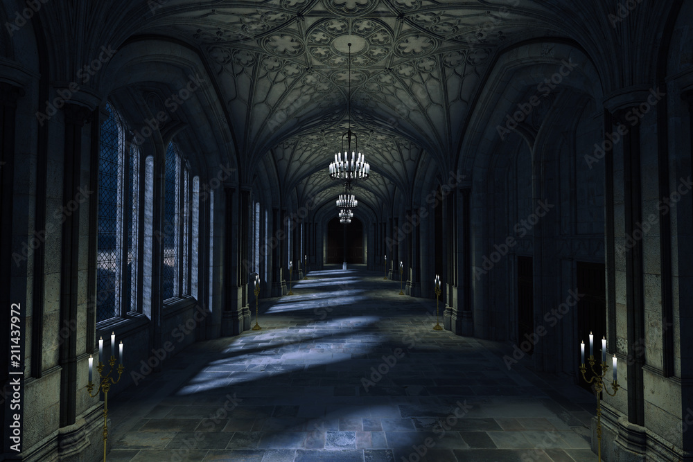
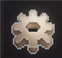
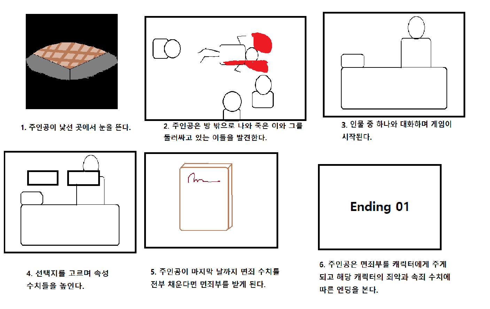

 
 

# 프로젝트명 :  신(Sin) (개발자 : 권정임)

 
 
 

# **목차**         

### [1. 게임명 : 신(Sin) (개발자 : 권정임)](#프로젝트명-:-신sin-개발자-:-권정임)
### [2. 컨셉](#컨셉)
### [3. 관련 이미지와 동영상](#관련-이미지와-동영상)
### [4. 대표 이미지](#대표-이미지)
### [5. 컨셉과 대표이미지 기반 작품묘사](#컨셉과-대표이미지-기반-작품묘사)
### [6. 신(Sin) 구성 요소](#신sin-구성-요소)
- 6-1. [메커니즘](#메커니즘)
- 6-2. [이야기](#이야기)
- 6-3. [미적 요소](#미적)
- 6-4. [기술](#기술)
### [7. 게임 시스템 디자인](#게임-시스템-디자인)
- 7-1. [게임 오브젝트 분해](#오브젝트)
- 7-2. [ 파라미터(속성)](#파라미터)
- 7-3. [ 상태](#상태)
- 7-4. [ 플레이어 캐릭터 속성(파라미터)](#속성)
- 7-5. [ 게임의 규칙](#규칙)
### [8. 개발 요구사항과 흐름도](#개발-요구사항과-흐름도)
### [9. 스토리 보드](#스토리-보드)
### [10. 프로토타입 개발 요구사항 (6주 개발)](#프로토타입-개발-요구사항-6주-개발)
### [11. 프로토타입 개발작업 일정 (6주 개발)](#프로토타입-개발작업-일정-6주-개발)
- 11-1. [구현 1주차](#1주차)
- 11-2. [구현 2주차](#2주차)

 
 
 

# **[컨셉]**

## 메인 컨셉 : 죄악
- 전체적인 스토리와 등장인물은 7대 죄악을 모티브로 하여 진행되지만 이는 플레이어들에게 명시적으로 제공되지 않는다.

### 서브 컨셉 1 : 선택
- 주인공은 스토리를 진행하면서 등장인물간의 갈등과 문제 상황을 해결하고 조율해나가며 여러 선택지 중 하나의 상황을 고른다.

### 서브 컨셉 2 : 성장
- 선택을 하게 된 플레이어는 어떤 선택을 했느냐에 따라 이에 맞는 속성을 증가시키며 다른 인물들의 속성에도 영향을 끼친다.

### 서브 컨셉 3 : 주선
- 플레이어의 속성으로 각각의 주선은 7대 죄악과 반대되는 의미를 지니며 엔딩과 밀접한 관련을 지닌다.

### 서브 컨셉 4 : 인물
- 등장인물들은 7대 죄악의 각 속성을 모티브로 하며 그에 맞춰 행동한다.

### 서브 컨셉 5 : 면죄
- 플레이어는 선택을 해나가며 등장인물에게 면죄부를 줄 수 있도록 한다.

 
 
 

# **[관련 이미지와 동영상]**

 

- 이미지

     ▲ 게임 더 슈라우디드 아일(The Shrouded Isle)의 가문이 가진 죄악과 미덕

 

     ▲ 인물의 대사가 나타나고, 주인공이 여러 선택지 중 하나를 고른다.

 

     ▲ 선택지에 따라 주인공과 관련 인물이 가진 속성이 변화한다.

 

- 동영상

 

     ▲ 게임 더 슈라우디드 아일(The Shrouded Isle)은 시뮬레이션 게임으로 주인공이 죄악을 속죄하는 내용을 담고 있다.
       각 가문은 죄악과 미덕을 하나씩 가지며 주인공이 어느 가문을 선택했느냐에 따라 해당하는 죄악이나 미덕에 영향을 받는다.
       또한 플레이어의 행동에 따라 각기 다른 여러 엔딩이 등장한다.

 
 
 

# **[대표 이미지]**

 

     ▲ 선택 전 이미지

 

     ▲ 선택 후 이미지

 

     ▲ 플레이어 스탯창 이미지

 
 
 

# **[컨셉과 대표이미지 기반 작품묘사]**

 

컨셉과 대표 이미지 기반 : 

- (UI구성) 플레이어의 피로도를 최소화하기 위해 최대한 직관적으로 정보를 얻을 수 있도록 한다.

- (대화창) 나레이션과 다양한 인물들 간의 대화가 출력된다. 이름 옆에는 인물의 속죄 수치가 표시된다.

- (우측) 스토리 흐름에 따라 플레이어의 선택지가 등장한다.

- (좌측) 플레이어의 선택 후, 이에 해당하는 주선 속성의 진행바가 등장하며 증가한다.

- (좌측상단) 스토리의 시간 흐름에 따라 변한다.

- (스텟창) 시간의 흐름과 플레이어의 정보, 수치를 알 수 있으며, 등장인물의 정보와 수치 역시 한눈에 볼 수 있도록 한다.

 
 
 

# **[신(Sin) 구성 요소]**

 

## **1. 메커니즘** 

 

**[도전 과제]**

- 인물들 간의 갈등에서 적합한 선택지를 고른다.

- 원하는 인물에게 다가가 플레이어의 속성을 높인다.

- 인물의 속죄 수치를 높인다.

- 플레이어의 특정 속성인 면죄를 높인다.

- 플레이어는 인물에게 적합한 죄악의 면죄부를 주어야 한다.

 

**[재미요소]**

- 랜덤으로 정해지는 주인공의 속성과 사망 인물을 통해 인물 별 엔딩의 난이도가 변화한다.

- 랜덤으로 발생하는 사건 속에서 원하는 속성이 오를 수 있도록 한다.

- 시간이 지남에 따라 속죄 수치가 가장 낮은 인물이 사망한다.

 
 

## **2. 이야기** 

 

주인공은 알 수 없는 장소에서 눈을 뜨고, 이해하기 힘든 문장이 적혀 있는 쪽지를 발견한다. 이후 주인공은 다른 이들과 만나 대화를 나눈다. 이후 주인공은 쪽지를 통해 본인이 다른 이들을 면죄해야 함을 알게 된다.

 

**[만들게 된 배경]**

선택을 통해 속성을 증가시키거나 감소시키며 이에 따라 엔딩을 결정하는 것은 예전부터 계속 사용되어 왔던 흔한 게임 진행 방식이다. 그러나 여전히 다양한 스토리로 다양한 게임이 만들어지며 소비자들의 흥미를 끌고 있다. 나 역시 기존의 게임 진행 방식을 고수한 채 내가 만든 스토리로 흘러가는 게임과 엔딩들을 보고 싶었다.

 

**[참신함]**

게임은 랜덤 요소를 끌어와 운이라는 요소를 추가해 플레이어가 최대한 변칙적인 플레이를 할 수 있도록 한다.

  

[카메라 관점]

어떠한 상황에서도 플레이어는 시각적으로 보이지 않는다. 인물들이 이동하거나 주인공이 이동하지 않는 한 시야는 정면으로 고정된다.

 
 

## **3. 미적 요소** 

 

**[디자인]**

인물들은 성격과 개성이 뚜렷하며, 충격을 받거나 기뻐함에 따라 표정이 변화하고 이미지가 흔들리는 효과를 받는다.

 

**[컬러]**

인물들은 각각의 상징 색깔을 가진다.

 

**[음향]**

게임에서 인물들이 대화할 때, 갈등이 시작될 때, 주인공이 어떤 선택을 내릴 때. 이에 수긍하거나 부정할 때마다 상황에 맞는 배경 음악이 재생되거나 사라진다. 인물의 감정 표현이나 행동에 따라 1~3초 내외의 짧은 효과음이 재생된다. 플레이어가 선택지나 배경 화면, UI의 버튼을 클릭할 때마다 클릭 여부를 알 수 있도록 짧은 효과음을 삽입한다.

 
 

## **4. 기술** 

 

윈도우 운영체제에 맞춰 개발한다.

 
 
 

# **[게임 시스템 디자인]**

 

 ## a. 게임 오브젝트 분해 
 

|연번|오브젝트 이름(영문이름)|오브젝트 이미지|
|:----:|:----:|:----:|
|1|시작하기(Button_start), 이어하기(Button_Working), 설정(Button_Setting), 종료하기(Button_Quit), 계속하기(Button_Continue), 저장하기(Button_Save), 불러오기(Slot_Import), 돌아가기(Button_Return)|(예시)|
|2|시작 배경(Background_Opening)||
|3|복도 배경(Background_Aisle)||
|4|방 배경(Background_Room)||
|5|거실 배경(Background_FrontRoom)||
|6|에디프(Character_Pride)| 붉은 머리 남성 (예시)|
|7|디어(Character_Greed)| 보라 머리 여성 (예시)|
|8|이브(Character_Envy) | 파란 머리 여성 (예시)|
|9|타르(Character_Wrath)| 주황 머리 남성 (예시)|
|10|이노(Character_Gluttony)| 노란 머리 여성 (예시)|
|11|터스(Character_Sloth)| 남색 머리 남성 (예시)|
|12|대화창(Screen_Chat)|(예시)|
|13|선택지(Button_Choice)|(예시)|
|14|설정_2(Button_Setting_Image)||
|15|날짜(Progress_Day)||
|16|쪽지(Item_Note)||
|17|면죄부(Item_Indulgence)||
|18|저장된 슬롯(Slot_Saved), 빈 슬롯(Slot_None)|(예시)|
|19|속죄 진행도(Progress_Atonement)||
|21|겸손-면죄 진행도(Progress_n)||
|22|속죄 수치(Progress_Atonement_Value)||
|23|겸손-면죄 수치(Progress_n_Value)||
|24|배경음(Sound_Background), 효과음(Sound_Effect)||

 
 

## b. 파라미터(속성) 

 

|속성|영문명칭|설명|비고|
|:----:|:----:|:----:|:----:|
|속죄|Progress_Atonement_Value|각 캐릭터의 속죄 수치이다. 선택지에 따라 1~10까지 랜덤으로 값이 누적된다. 최대 값 100이 되면 이후 값이 고정된다.||

 
 

## c. 상태 

 

|현상태|전이상태|전이조건|
|:----:|:----:|:----:|
|정상 상태||아무 조건도 만족하지 못했을 때 기본으로 적용되도록 한다.|
|정상 상태|분노 상태|스크립트에 !가 2개 이상일 때 해당 스크립트의 다음 스크립트까지 적용된다.|
|정 상상태|걱정 상태|스크립트에 … 가 2개 이상일 때 해당 스크립트의 다음 스크립트까지 적용된다.|
|정상 상태|놀란 상태|스크립트에 !가 2개 이하일 때 해당 스크립트의 다음 스크립트까지 적용된다.|

 
 

## d. 플레이어 캐릭터 속성(파라미터) 

 

|속성|영문명칭|설명|비고|
|:----:|:----:|:----:|:----:|
|겸손|Progress_Pride|값 0을 할당받는다. 이후 선택지를 고를 때마다 해당하는 2개의 속성 수치가 1~10, 1~5씩 증가하며 값이 누적된다. 다른 경우에는 10의 값이 누적된다. 최대 값 100이 되면 이후 값이 고정된다.||
|자선|Progress_Greed|값 0을 할당받는다. 이후 선택지를 고를 때마다 해당하는 2개의 속성 수치가 1~10, 1~5씩 증가하며 값이 누적된다. 다른 경우에는 10의 값이 누적된다. 최대 값 100이 되면 이후 값이 고정된다.||
|친절|Progress_Envy|값 0을 할당받는다. 이후 선택지를 고를 때마다 해당하는 2개의 속성 수치가 1~10, 1~5씩 증가하며 값이 누적된다. 다른 경우에는 10의 값이 누적된다. 최대 값 100이 되면 이후 값이 고정된다.||
|인내|Progress_Wrath|값 0을 할당받는다. 이후 선택지를 고를 때마다 해당하는 2개의 속성 수치가 1~10, 1~5씩 증가하며 값이 누적된다. 다른 경우에는 10의 값이 누적된다. 최대 값 100이 되면 이후 값이 고정된다.||
|절제|Progress_Gluttony|값 0을 할당받는다. 이후 선택지를 고를 때마다 해당하는 2개의 속성 수치가 1~10, 1~5씩 증가하며 값이 누적된다. 다른 경우에는 10의 값이 누적된다. 최대 값 100이 되면 이후 값이 고정된다.||
|근면|Progress_Sloth|값 0을 할당받는다. 이후 선택지를 고를 때마다 해당하는 2개의 속성 수치가 1~10, 1~5씩 증가하며 값이 누적된다. 다른 경우에는 10의 값이 누적된다. 최대 값 100이 되면 이후 값이 고정된다.||
|면죄|Progress_Absolution|값 0을 할당받는다. 이후 선택지를 고를 때마다 1~10씩 증가한다. 최대 값 100이 되면 이후 값이 고정된다.||

 
 

## e. 게임의 규칙 

 

플레이어는 선택지를 고르며, 엔딩을 보길 원하는 캐릭터의 속죄 수치와, 그 캐릭터와 짝지어지는 본인의 속성 값과 면죄 수치를 증가시킨다. 하루가 끝날 때마다 원하는 인물의 방에 찾아가 그 인물의 속죄 수치를 증가시킬 수 있다. 둘째 날부터 속죄 수치가 가장 낮은 등장인물이 죽으며, 6일째 되는 날까지 플레이어의 면죄가 100을 달성하면 아이템 ‘면죄부’를 받게 된다. 마지막 날, 아이템의 죄악을 선택한 후 해당 캐릭터에게 사용하면 캐릭터의 속죄 수치와 플레이어의 특정 속성 수치에 따라 엔딩이 나온다. 캐릭터에게 알맞은 죄악의 면죄부를 주지 않거나, 면죄 100을 달성하지 못한다면 또다른 엔딩이 나오며, 이는 다른 수치에 상관없이 동일하다.

 
 
 

# **[개발 요구사항과 흐름도]**

 

## **1. 요구사항**

 

<!--시작화면-->
**시작 화면**
- 시작 화면, 설정화면, 저장 화면, 게임 화면, 스탯 화면 총 5개의 화면이 있다.
- 시작 화면에는 시작하기, 이어하기, 설정, 종료하기 버튼이 있다.
- 시작하기를 클릭하면 게임 화면으로 이동한다.
- 이어하기를 누르면 저장 화면으로 이동한다.
- 설정을 누르면 설정 화면으로 이동한다.
- 이어하기는 저장 데이터가 존재하는 경우에만 활성화되어 있다.
- 종료하기를 클릭하거나 ESC를 누르면 게임이 종료된다.

<!--설정화면-->
**설정 화면**
- 설정을 클릭하면 설정화면이 창처럼 뜨며 그외의 화면들은 뿌얘진다.
- 설정화면의 상단에는 위아래로 배경음과 효과음을 조절하는 스크롤 바가 있다.
- 설정화면의 하단에는 가로 방향으로 저장하기, 불러오기, 돌아가기 버튼이 있다.
- 시작화면에서 설정화면으로 이동한 경우에는 저장하기가 비활성화되어 있다.
- 설정화면에서 불러오기를 클릭하면 저장 화면으로 이동한다.
- 돌아가기를 클릭하거나 ESC를 누르면 설정화면이 종료된다.

<!--저장화면-->
**저장 화면**
- 저장화면에는 3개의 데이터 창이 존재한다.
- 데이터창의 왼쪽에는 해당 진행에서 속죄 수치가 가장 높은 캐릭터의 초상화가 나타나고, 그 옆에는 플레이어의 면죄 수치가 진행바로 나타나 있다.
- 저장화면의 하단에는 차례로 저장하기와 불러오기, 돌아가기가 있다.
- 저장하기는 데이터 창을 클릭한 경우에만 활성화된다.
- 불러오기는 저장 데이터가 있는 창을 클릭한 경우에만 활성화되며, 클릭한 경우에는 게임 화면으로 이동한다.
- 돌아가기를 클릭하거나 ESC를 누르면 저장화면이 뜨기 전 화면으로 되돌아간다.

<!--게임화면_1-->
**게임 화면**
- 게임화면의 왼쪽 상단에는 날짜가, 오른쪽 상단에는 설정화면을 띄울 수 있는 이미지 버튼이 있다.
- 하단에는 스크립트를 볼 수 있는 창이 있고, 이 대화창의 왼쪽 상단에는 말하고 있는 등장 인물의 이름이 뜬다.
- 대사는 글자가 차례로 나타나며, 대화창 오른쪽 하단의 화살표를 클릭하면, 바로 모든 대사가 뜬다.
- 대사가 있는 인물이 최소 1명에서 최대 3명까지 화면에 나타나며, 인물 이미지의 일부는 대화창에 가려져 있다.
- 선택지는 최소 두 개에서 최대 세 개까지 차례로 화면의 중앙에 차례로 위치한다.
- ESC를 누르면 설정화면이 뜬다.

<!--게임화면_2-->
- 선택지를 고르고 다음 스크립트가 나오면 화면의 왼쪽에 플레이어의 모든 속성들의 진행바가 나타났다가 2초간 증가 후 3초 후 사라진다.
- 플레이어의 속성은 선택지에 따라 두 개가 증가하며 이 둘은 각각 랜덤으로 1~10, 1~5씩 증가한다.
- 선택지를 고르고 다음 스크립트가 나오면 해당 인물의 면죄 수치 진행바가 나타났다가 1초간 증가 후 3초 후 사라진다.
- 해당 인물의 면죄 수치는 1~10씩 랜덤으로 증가한다.

- 플레이어는 매일 밤 한 명에게 찾아가 대화할 수 있다.
- 대화에서 어떤 선택을 했느냐에 따라 해당 인물과 관련된 플레이어의 속성이 10 증가하거나 유지된다.

<!--속성화면-->
**속성 화면**
- 화면의 왼쪽엔 플레이어의 속성과 수치가 진행바와 숫자로 존재한다.
- 화면의 오른쪽엔 캐릭터의 초상화와 속죄의 진행도, 속죄의 수치가 존재한다. 사망한 인물의 경우 초상화가 흑백으로 나타난다.

**엔딩 화면**
- 플레이어의 면죄가 100이 되면 아이템 '면죄부'를 받는다.
- 플레이어는 어떤 죄악의 면죄부를 받을 지 선택한다.
- 마지막 날 플레이어는 마지막으로 남은 이에게 무조건 면죄부를 사용한다.
- 면죄부를 사용하면 플레이어가 남아있는 인물에게 알맞은 죄악의 면죄부를 주었는지와 해당 인물의 속죄 수치가 무엇인지에 따라 각각의 엔딩 화면이 나온다.
- 마지막 날 전까지 플레이어가 면죄부를 얻지 못한다면, 이외의 속성 수치와 관계없이 동일한 엔딩이 나온다.

- 버튼을 클릭할 때마다 짧은 효과음이 난다.
- 게임의 분위기와 상황에 따라 다른 배경음이 흐른다.

 
 

## **2. 흐름도**

 

 
 
 

# **스토리 보드**

 
 
 

# [프로토타입 개발 요구사항 (6주 개발)]

 
 

### 1주차 - 개별 씬 제작

- 시작 화면, 설정화면, 저장 화면, 게임 화면이 있다.
- 시작 화면에는 시작하기, 이어하기, 설정, 종료하기 버튼이 있다.
- 시작하기를 클릭하면 게임 화면으로 이동한다.
- 이어하기를 클릭하면 저장 화면으로 이동한다.
- 설정을 클릭하면 설정 화면으로 이동한다.
- 종료하기를 클릭하거나 ESC를 누르면 게임이 종료된다.

 

### 2주차 - 게임 화면 일부 구현

- 게임화면의 왼쪽 상단에는 날짜가, 오른쪽 상단에는 설정화면을 띄울 수 있는 이미지 버튼이 있다.
- 하단에는 스크립트를 볼 수 있는 창이 있고, 이 대화창의 왼쪽 상단에는 말하고 있는 등장 인물의 이름이 뜬다.
- 대사는 글자가 차례로 나타나며, 대화창 오른쪽 하단의 화살표를 클릭하면, 바로 모든 대사가 뜬다.
- ESC를 누르면 설정화면이 뜬다.

 

### 3주차 - 스탯 화면 일부 구현

- 화면의 왼쪽에, 플레이어 속성의 진행도가 진행바와 숫자로 나타난다.
- 화면의 오른쪽에 캐릭터 속죄의 진행도가 진행바와 숫자로 나타난다.
- 돌아가기를 클릭하거나 ESC를 누르면 스탯 화면이 종료된다.

 

### 4주차 - 선택지 구현

- 선택지는 게임 화면의 중앙에 두 개에서 세 개까지 나타난다.
- 선택지를 고르고 다음 스크립트가 나오면 화면의 왼쪽에 플레이어의 모든 속성들의 진행바가 나타났다가 2초간 증가 후 3초 후 사라진다.
- 플레이어의 속성은 선택지에 따라 두 개가 증가하며 이 둘은 각각 랜덤으로 1~10, 1~5씩 증가한다.

 

### 5주차 - 설정 화면 구현

- 설정화면의 상단에는 위아래로 배경음과 효과음을 조절하는 스크롤 바가 있다.
- 설정화면의 하단에는 가로 방향으로 저장하기, 불러오기, 돌아가기 버튼이 있다.
- 설정 화면에서 불러오기를 클릭하면 저장 화면으로 이동한다.
- 돌아가기를 클릭하거나 ESC를 누르면 설정화면이 종료된다.

 

### 6주차 - 저장 화면 구현

- 저장 화면에는 3개의 데이터 창이 존재한다.
- 저장화면의 하단에는 차례로 저장하기와 불러오기, 돌아가기가 있다.
- 저장하기는 데이터 창을 클릭한 경우에만 활성화된다.
- 돌아가기를 클릭하거나 ESC를 누르면 저장화면이 뜨기 전 화면으로 되돌아간다.

 
 

# [프로토타입 개발작업 일정 (6주개발)]

### **구현 1주차 **

 

**작업명 :  화면 전환과 시작 화면 버튼 제작**

해당 요구사항 :

- 시작 화면, 설정 화면, 저장 화면, 게임 화면, 스탯 화면 총 5개의 화면이 있다. (80%)
- ~~시작 화면에는 시작하기, 이어하기, 설정, 종료하기 버튼이 있다. (100%)~~
- ~~시작하기를 클릭하면 게임 화면으로 이동한다. (100%)~~
- ~~이어하기를 누르면 저장 화면으로 이동한다. (100%)~~
- ~~설정을 누르면 설정 화면으로 이동한다. (100%)~~
- ~~종료하기를 클릭하거나 ESC를 누르면 게임이 종료된다. (100%)~~

 

작업 내용 : 

- 시작 화면과 시작 화면 버튼을 제작한다.
- 비어있는 게임 화면을  제작한 후 시작하기를 누르면 게임 화면으로 이동하도록 한다.
- 비어있는 게임 화면을  제작한 후 이어하기를 누르면 저장 화면으로 이동하도록 한다.
- 비어있는 게임 화면을  제작한 후 설정을 누르면 설정 화면으로 이동하도록 한다.
- 종료하기와 ESC를 누르면 게임이 종료되도록 한다.

 

▲ 화면 전환

 

▲ 종료 구현

 

### **구현 2주차 **

 

**작업명 : 게임 화면 일부 구현**

해당 요구사항 : 

- ~~게임 화면의 왼쪽 상단에는 날짜가, 오른쪽 상단에는 설정 화면을 띄울 수 있는 이미지 버튼이 있다. (100%)~~
- ~~하단에는 스크립트를 볼 수 있는 창이 있고, 이 대화창의 왼쪽 상단에는 말하고 있는 캐릭터의 이름이 뜬다. (100%)~~
- ~~대사는 글자가 차례로 나타나며, 글자가 나오는 중 대화창 오른쪽 하단의 화살표를 클릭하면, 바로 모든 대사가 뜬다. (100%)~~
- ~~대사가 다 나온 상태에서 화살표를 클릭하면 스크립트가 넘어간다. (100%)~~
- 대사가 다 나온 후 6초가 지나면 자동으로 스크립트가 넘어간다. (0%)
- ~~ESC를 누르면 설정 화면이 뜬다. (100%)~~

 

작업 내용 : 

- 게임 화면의 왼쪽 상단에 날짜를 입력한다.
- 오른쪽 상단에 이미지 버튼을 눌러 클릭 시 설정 화면이 뜨도록 한다.
- 대화창과 캐릭터의 이름이 뜨는 창을 만든다.
- 대화창에 스크립트의 글자가 차례로 나타난다.
- 대화창 오른쪽 화살표를 클릭하면 대사가 전부 뜬다.
- 대사가 다 나온 상태에서 아무 액션 없이 6초가 지나면 스크립트가 자동으로 넘어간다.
- ESC를 누르면 설정 화면이 뜬다.

 

▲ 대화창 구현

